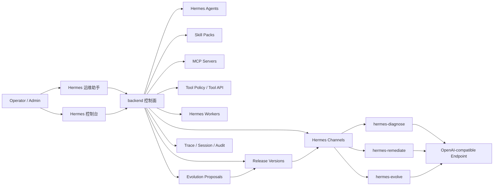

# 阶段 28：Hermes Capability Control Plane 设计

## 背景

阶段 17-21 已经把 Hermes 的连接、工具、Skill Pack、MCP Server 和 Agent 绑定从散落配置逐步抽象为 Channel 能力模型。

阶段 22-27 已经把 Hermes Runtime 推进为三个真实 Worker，并建立了受控自我进化闭环：

```text
Trace / Worker Run / Session / Approval / Task
  -> Hermes Evolve
  -> Evolution Proposal
  -> Evaluation
  -> Admin Approval
  -> Release Version
  -> Rollback
```

现在系统的问题不再是“有没有 Hermes 能力”，而是“这些能力如何被操作者、管理员和平台自己清晰地理解、治理、发布和回滚”。

阶段 28 的核心目标是收敛，而不是继续堆功能。

## 核心判断

当前方向是合适的：

- Hermes Worker 只负责推理，不连接平台数据库，不直接执行生产动作。
- backend 继续作为控制面，负责 Tool API、PolicyGuard、Approval、Audit、Trace、Task 和 Release。
- Hermes Evolve 最多生成 proposal 和推动到待审批，不自动 approve/publish。
- Channel 是能力入口，Agent 是业务角色，Skill/MCP/Tool/Policy 是能力组件。

下一步需要把这些对象组合成一个清晰的产品化控制面：

```text
Hermes Capability Control Plane
  -> Channel
  -> Agent Binding
  -> Worker
  -> Skill Pack
  -> MCP Server
  -> Tool Policy
  -> Runtime Trace
  -> Evolution Proposal
  -> Release Version
```

## 阶段目标

阶段 28 目标：

- 建立统一的 Hermes 能力控制台信息架构。
- 给 Channel、Agent、Worker、Skill、MCP、Tool、Proposal、Release 建立清晰关系视图。
- 让管理员能回答：
  - 当前 Hermes 有哪些通道？
  - 每个通道由哪个 Worker 承载？
  - 每个通道绑定哪些 Agent？
  - 每个通道启用了哪些 Skill / MCP / Tool？
  - 当前运行版本是什么？
  - 最近是否发生 fallback、失败、提案、发布或回滚？
  - 如果要让 Hermes 自我进化，变更会影响哪些对象？
- 为后续“结构化 patch 生效到运行态”打基础。

阶段 28 不直接追求：

- 自动修改生产 Skill / Workflow / MCP / Tool Policy。
- 放开 MCP tool execution。
- 让 Hermes Worker 直接连接数据库。
- 让 proposal 自动 approve/publish。
- 重构现有 Agent 执行器主流程。

## 目标架构



## 产品入口

当前已有两个入口：

- `Hermes 运维助手`：面向操作者，解决诊断、修复编排、复盘优化。
- `Hermes 控制台`：面向管理员，管理 Channel、Skill、MCP 和 Worker。

阶段 28 建议把 `Hermes 控制台` 收敛为以下 Tab：

```text
概览 Overview
通道 Channels
Agent 绑定 Agent Bindings
Workers
Skills
MCP Servers
Tool Policy
发布版本 Releases
运行证据 Runtime Evidence
```

其中 `概览` 是最关键的新能力。它应该把已有数据聚合成一个控制面，而不是让用户在多个页面跳转。

## 概览页设计

概览页展示四类信息。

### 1. Runtime Topology

展示当前 Hermes 拓扑：

```text
Hermes 诊断通道
  -> Hermes 诊断修复 Agent
  -> hermes-diagnose
  -> model / base_url / health / fallback rate
  -> enabled tools / skills / MCP servers

Hermes 修复编排通道
  -> Hermes 修复编排 Agent
  -> hermes-remediate
  -> approval-required tools
  -> recent task success/failure

Hermes 复盘通道
  -> Hermes 复盘进化 Agent
  -> hermes-evolve
  -> proposals / evaluations / releases
```

### 2. Capability Inventory

按 Channel 汇总能力：

| 维度 | 内容 |
| --- | --- |
| Tools | 工具数量、危险工具数量、是否需要审批 |
| Skills | 启用 Skill Pack、版本、风险说明 |
| MCP | 绑定 MCP Server、健康、tool import mode |
| Policy | 当前策略、最大工具轮次、温度、超时 |
| Secret | 只显示引用，不显示明文 |

### 3. Evolution State

展示自我进化状态：

| 指标 | 含义 |
| --- | --- |
| queued review items | 等待复盘的失败/fallback/拒绝审批样本 |
| generated proposals | 已生成提案 |
| eval passed / failed | 评估通过/失败 |
| approval pending | 等待管理员处理 |
| published versions | 已发布版本 |
| active releases | 当前生效版本账本 |

这里要明确提示：

```text
持续进化不会自动修改生产环境。
提案必须经过 evaluation、admin approval 和 publish。
当前 release version 仍是发布账本，不直接改写生产对象。
```

### 4. Risk Surface

展示风险面：

- Worker fallback 是否频繁。
- 是否有 Channel 未绑定 Worker。
- 是否有 Channel 使用 legacy runtime_config。
- 是否有 enabled MCP Server 但 tool import mode 仍未明确。
- 是否有高风险工具启用但缺少 approval policy。
- 是否有 proposal 发布后没有 rollback 记录。
- 是否存在长期未处理的 review queue。

## 领域模型收敛

阶段 28 不一定立即新建大量表，但需要确立统一模型。

### Capability Graph

建议把以下关系视为 Hermes capability graph：

```text
Agent
  -> Channel
    -> Worker role
    -> Runtime config
    -> Tool allowlist
    -> Skill Packs
    -> MCP Servers
    -> Policy
    -> Active Release Versions
    -> Runtime Evidence
```

### Active Release 语义

阶段 26 已有 `evolution_release_versions`，但当前只是发布账本。阶段 28 需要先在设计上明确 active release 的未来消费方式：

```text
active release
  -> 不直接修改源表
  -> 作为 overlay 注入 runtime
  -> 可回滚
  -> 可审计
```

后续阶段可以把 release payload 从非结构化文本升级为结构化 patch：

```text
skill_patch
workflow_template_patch
tool_policy_patch
mcp_binding_patch
channel_runtime_patch
prompt_patch
```

阶段 28 只定义这个方向，不立即执行生产变更。

## 后端聚合 API 设计

建议新增只读聚合 API，避免前端同时请求过多细碎接口：

```text
GET /api/hermes-control-plane/overview
GET /api/hermes-control-plane/capability-graph
GET /api/hermes-control-plane/risk-summary
```

### overview 返回建议

```json
{
  "channels": [],
  "workers": [],
  "agentBindings": [],
  "capabilityInventory": [],
  "evolutionState": {},
  "releaseState": {},
  "riskSummary": []
}
```

### capability graph 返回建议

```json
{
  "nodes": [
    { "id": "channel:diagnose", "type": "channel", "label": "Hermes 诊断通道" },
    { "id": "worker:diagnose", "type": "worker", "label": "hermes-diagnose" },
    { "id": "agent:diagnose", "type": "agent", "label": "Hermes 诊断修复 Agent" }
  ],
  "edges": [
    { "source": "agent:diagnose", "target": "channel:diagnose", "type": "binds_to" },
    { "source": "channel:diagnose", "target": "worker:diagnose", "type": "routes_to" }
  ]
}
```

### risk summary 返回建议

```json
{
  "items": [
    {
      "severity": "warning",
      "category": "runtime",
      "message": "diagnose channel used fallback 3 times in 24h",
      "action": "check_worker"
    }
  ]
}
```

## 权限边界

| 能力 | viewer | operator | admin |
| --- | --- | --- | --- |
| 查看概览 | yes | yes | yes |
| 查看 capability graph | yes | yes | yes |
| 查看风险摘要 | yes | yes | yes |
| 测试 Channel / Worker | no | yes | yes |
| 修改 Channel / Skill / MCP | no | no | yes |
| 手动运行 evolution task | no | yes | yes |
| approve proposal | no | no | yes |
| publish / rollback release | no | no | yes |

页面上需要明确显示当前用户处于：

```text
只读模式 / 可操作模式 / 管理模式
```

## 安全边界

阶段 28 必须继续坚持：

- 不展示 secret 明文。
- Worker 不连接数据库。
- MCP Server 先作为 registry，不默认开放 tool execution。
- 高风险工具必须经过 approval。
- Runtime overlay 只能来自 active release，并且 release 必须可回滚。
- Evolve 不能绕过 proposal/evaluation/approval/publish 链路。

## 与现有页面关系

阶段 28 不建议删除现有页面。

建议关系：

| 页面 | 定位 |
| --- | --- |
| Hermes 运维助手 | 操作者入口，执行诊断、修复、复盘 |
| Hermes 控制台 | 管理入口，统一治理能力和风险 |
| Agent 管理 | Agent 基础信息和 Channel 绑定 |
| 进化提案 | proposal/evaluation/release 详细操作 |
| 工具审批 | 实际生产动作审批 |
| 关联链路视图 | trace、task、approval、session 证据链 |

Hermes 控制台应该提供跳转，而不是复制所有细节。

## 推荐实施拆分

### 阶段 28a：只读控制台概览

目标：先把已有对象聚合展示，不改运行逻辑。

工作项：

- 新增 `GET /api/hermes-control-plane/overview`。
- Hermes 控制台新增 `概览` Tab。
- 展示 Channel -> Agent -> Worker -> Skill/MCP/Tool 摘要。
- 展示 Worker run/fallback/latency 摘要。
- 展示 proposal/evaluation/release/queue 摘要。

验收：

- 管理员打开一个页面就能看懂三个 Hermes 的运行和能力状态。
- 不新增写操作。
- 不影响现有 Hermes 助手和 Agent 执行。

### 阶段 28b：Capability Graph

目标：把关系从表格变成图谱。

工作项：

- 新增 `GET /api/hermes-control-plane/capability-graph`。
- 前端展示能力关系图或分组拓扑。
- 节点支持跳转到 Channel、Agent、Worker、Skill、MCP、Release。

验收：

- 能清楚看到每个 Agent 最终使用哪个 Worker 和哪些能力组件。

### 阶段 28c：Risk Summary

目标：把运维风险显性化。

工作项：

- 新增 risk summary 计算。
- 识别 fallback、未绑定、legacy config、高风险工具、MCP 健康异常、长期未处理 proposal。
- 控制台展示风险等级和建议动作。

验收：

- 管理员能优先处理最重要的问题，而不是翻日志。

### 阶段 28d：Release Overlay 设计固化

目标：为后续 active release 生效到 runtime 做准备。

工作项：

- 定义结构化 patch schema。
- 定义 release overlay 读取顺序。
- 定义 rollback 后 runtime 如何回退。
- 增加文档和测试计划，不立即修改生产对象。

验收：

- 后续阶段可以安全地把 release version 用于 runtime，而不是直接改源表。

## 验收标准

阶段 28 完成时应满足：

- 有一份明确的 Hermes Capability Control Plane 设计文档。
- 有清晰的页面信息架构。
- 有聚合 API 草案。
- 有 capability graph 模型。
- 有 risk summary 模型。
- 有权限和安全边界。
- 有 28a-28d 的可执行拆分。
- 明确说明当前不会自动修改生产对象。

## 后续路线

阶段 28 之后，合理的演进顺序是：

```text
阶段 28a：只读控制台概览
阶段 28b：Capability Graph
阶段 28c：Risk Summary
阶段 28d：Release Overlay 设计固化
阶段 29：结构化 Evolution Patch
阶段 30：Release Overlay Runtime 注入
阶段 31：MCP Tool Bridge 受控执行
阶段 32：多环境 / 多租户 / 灰度发布
```

其中阶段 29 和 30 是让“自我进化”从 proposal 走向真正可控生效的关键，但必须建立在阶段 28 的控制面之上。
