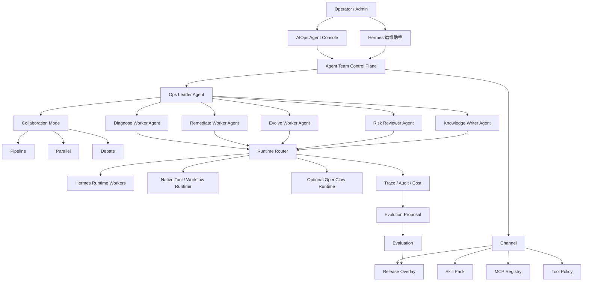

# AIOps Agent 数字运维团队产品化路线

## 背景

参考“从单 Agent 工具升级为数字员工团队”的理念，AIOps Agent 后续不应继续只围绕单个 Agent、单个 Runtime 或单个工具入口堆功能，而应该把现有 Hermes Worker、Channel、Skill、MCP、Workflow、Policy、Trace、Evolution Proposal 和 Release Overlay 组织成一套可被企业理解、治理和持续运营的数字运维团队平台。

当前系统已经具备以下基础：

- 三个 Hermes Worker：`diagnose`、`remediate`、`evolve`。
- Hermes Channel：诊断、修复编排、复盘进化。
- Skill Pack、MCP Server Registry、Tool Policy、Approval、Trace。
- Evolution Proposal、Evaluation、Release Version、Release Overlay Runtime。
- Hermes 控制台、Hermes 运维助手、进化提案页面。

下一阶段的关键不是“让模型更自由”，而是让系统从“能运行 Agent”升级为“能管理一支 AI 运维团队”。

## 产品定位

目标定位：

```text
AIOps Agent = 可管理、可协作、可审计、可进化的数字运维团队平台
```

操作者不应该感知为“我在调用一个 Agent”，而应该感知为：

- 我有一个运维 Leader 负责拆解、调度和裁决。
- 我有多个专业 Worker 负责诊断、修复、复盘、审查、文档沉淀。
- 我可以选择团队模板完成告警诊断、巡检、修复审批、故障复盘。
- 平台会沉淀经验为 Skill，并通过受控发布机制让团队越用越懂业务。

## 设计原则

### 1. Leader-Worker 协作，而不是单 Agent 全包

复杂运维任务天然包含多个角色：

- Leader：拆解任务、选择协作模式、分配 Worker、汇总结论。
- Diagnose Worker：只读诊断、证据收集、影响面判断。
- Remediate Worker：修复方案、审批提交、任务编排。
- Evolve Worker：复盘、提案、Skill/Workflow/Policy 改进建议。
- Risk Reviewer：风险审查、变更窗口、回滚计划检查。
- Knowledge Writer：将处理过程沉淀为知识、SOP、Skill 草案。

### 2. Hermes 做长期记忆和经验沉淀

Hermes 是核心 Runtime，承担：

- 长期上下文和经验复用。
- Skill 生成、版本化和引用。
- 任务状态跟踪。
- 失败样本复盘和持续进化提案。

OpenClaw 类 Runtime 可以作为可选短任务 Runtime，但不作为当前主线依赖。

### 3. backend 始终是控制面

Hermes Worker 只负责推理，不直接连接生产数据库，不直接执行危险工具。

backend 继续负责：

- Tool API。
- PolicyGuard。
- Approval。
- Audit。
- Trace。
- Task / Workflow。
- Skill / MCP / Channel / Release 管理。

### 4. 自我进化必须受控

持续进化链路必须保持：

```text
Trace / Worker Run / Failure / Approval
  -> Evolve 分析
  -> Evolution Proposal
  -> Evaluation
  -> Admin Approval
  -> Release
  -> Runtime Overlay
  -> Rollback
```

任何自动生成内容不能绕过 evaluation、approval、publish 和 rollback。

## 目标架构



## 统一领域模型

| 对象 | 定义 | 当前映射 | 后续演进 |
| --- | --- | --- | --- |
| Runtime | Agent 实际推理/执行后端 | Hermes Worker、Native Tool Runtime | 可选接入 OpenClaw 类短任务 Runtime |
| Channel | 能力通道，绑定 Runtime、模型、工具、Skill、MCP、Policy | Hermes Channels | 成为 Agent/Team 的能力选择入口 |
| Agent | 一个角色和职责 | Hermes 诊断/修复/复盘 Agent | 扩展为 Leader/Worker 角色体系 |
| Team | 一组 Agent 的协作模板 | 暂无一等对象 | 新增 Team Template 和 Team Run |
| Skill | 可复用经验资产 | Skill Pack Registry | 支持来源、版本、评估、发布、回滚 |
| MCP | 外部能力注册中心 | MCP Server Registry | 受控导入 Tool API，纳入审批审计 |
| Workflow | 可执行运维流程 | Workflow Templates | 支持 Team 自动选择和编排 |
| Policy | 安全和工具边界 | Tool Policy / Permission Boundary | 与 Team、Channel、Release 联动 |
| Trace | 证据链 | Agent Execution、Worker Run、Audit | 支撑复盘、提案、成本和治理 |
| Release | 可控运行态版本 | Release Version / Overlay | 影响 Skill/MCP/Workflow/Policy 的 effective config |

## 协作模式

### Pipeline：流水线

适合有明确步骤的任务。

示例：

```text
告警输入
  -> Diagnose Worker 收集证据
  -> Risk Reviewer 判断风险
  -> Remediate Worker 生成修复计划
  -> Approval
  -> Workflow 执行
  -> Evolve Worker 复盘
```

### Parallel：并行

适合批量巡检、批量服务器分析、批量日志摘要。

示例：

```text
50 台服务器巡检
  -> Leader 按服务器分组
  -> 多个 Diagnose Worker 并行执行
  -> Leader 汇总异常
  -> Risk Reviewer 排序风险
```

### Debate：讨论裁决

适合上线评估、修复方案选择、策略调整。

示例：

```text
是否发布某个 Skill 更新
  -> Evolve Worker 给出收益
  -> Risk Reviewer 给出风险
  -> Diagnose Worker 给出历史证据
  -> Leader 汇总并提出建议
  -> Admin 决策
```

## 产品化主线 P1-P6

### P1：产品定位与信息架构收敛

目标：

- 把系统叙事从“Agent 管理平台”升级为“数字运维团队平台”。
- 让用户理解 Agent、Channel、Skill、MCP、Workflow、Policy、Trace、Release 的关系。

工作项：

- 更新产品文案和文档：
  - AIOps Agent。
  - 数字运维团队。
  - Hermes 是长期记忆和经验沉淀 Runtime。
- Hermes 控制台重组为：
  - 总览。
  - Teams。
  - Channels。
  - Agents。
  - Skills。
  - MCP Servers。
  - Tool Policy。
  - Runtime Evidence。
  - Releases。
- 在控制台增加能力关系图：
  - Team -> Agent -> Channel -> Worker -> Skill/MCP/Policy -> Release。
- 明确 OpenClaw 类 Runtime 是可选适配，不阻塞主线。

验收：

- 管理员可以从一个页面看懂当前有几支 AI 运维团队。
- 每个 Agent 的 Channel、Worker、Skill、MCP、Policy、Release 都可追溯。
- 页面和文档不再把 Hermes 作为隐藏 Runtime，而是作为可管理能力。

实施切片：

- P1a：产品文案收敛，把平台描述升级为“数字运维团队平台”。
- P1b：在 Hermes 控制台顶部增加派生 Team Overview，不新增数据库表。
- P1c：用现有 Channel / Agent Binding / Worker / Skill / MCP / Release 数据展示团队能力覆盖。
- P1d：明确 Team 当前是只读产品模型，P2 再升级为 `agent_teams` 和 `agent_team_runs` 一等对象。

P1 需要避免：

- 不改现有执行器。
- 不新增 Team Run 状态机。
- 不改变 Hermes Runtime Router。
- 不开放新的 MCP tool execution。
- 不让自我进化自动影响生产。

### P2：Agent Team 与 Leader-Worker 编排

目标：

- 新增 Team 一等对象。
- 支持 Leader-Worker 协作模式。

工作项：

- 新增数据模型：
  - `agent_teams`
  - `agent_team_members`
  - `agent_team_runs`
  - `agent_team_run_steps`
- 新增 Team Template：
  - 告警诊断与修复团队。
  - 服务器巡检团队。
  - 变更风险审查团队。
  - 故障复盘进化团队。
- 新增 Leader Agent：
  - 输入任务目标。
  - 选择协作模式。
  - 分配 Worker。
  - 汇总输出。
- 支持三种编排：
  - `pipeline`
  - `parallel`
  - `debate`
- Team Run 写入 trace，并关联 worker runs、approvals、tasks、proposals。

验收：

- 操作者可以选择 Team Template 发起任务。
- Team Run 可以展示 Leader 决策、Worker 输出和最终结论。
- Pipeline 模式至少跑通“告警诊断 -> 修复建议 -> 审批提交”。
- Parallel 模式至少跑通“多服务器状态摘要”。
- Debate 模式至少跑通“发布建议讨论”。

### P3：Hermes Skill 经验沉淀闭环

目标：

- 让 Hermes 运行经验形成可复用 Skill，而不是只停留在 trace。

工作项：

- 每次 Team Run 结束后生成经验摘要：
  - 背景。
  - 证据。
  - 决策。
  - 成功/失败。
  - 可复用步骤。
- 支持从复盘结果生成 Skill Candidate。
- Skill Candidate 包含：
  - 来源 trace。
  - 适用场景。
  - 前置条件。
  - 工具依赖。
  - 风险级别。
  - 回滚/禁用建议。
- 接入现有 Evolution Proposal：
  - `skill_update`
  - `workflow_template_update`
  - `tool_policy_update`
  - `prompt_update`
- Skill 发布后通过 Release Overlay 影响 runtime effective config。

验收：

- 成功任务可以一键生成 Skill Candidate。
- 失败任务可以生成修复型 Skill Proposal。
- 发布后的 Skill 在下一次 Team Run trace 中能看到 active release version。
- 回滚后 Team Run 使用旧版本配置。

### P4：统一控制台与运营视图

目标：

- 做出类似 ClawManager 的统一中控感。
- 管理员能从一个控制台看团队、能力、成本、安全和进化状态。

工作项：

- 新增或增强控制台 Tab：
  - Team Overview。
  - Runtime Topology。
  - Capability Inventory。
  - Evolution Operations。
  - Cost & Usage。
  - Risk Surface。
- Team Overview 展示：
  - 团队数量。
  - Leader/Worker 角色。
  - 最近运行。
  - 成功率。
  - 待审批事项。
- Evolution Operations 展示：
  - 哪些 proposal 来自哪些失败。
  - 为什么通过/失败。
  - 是否值得发布。
  - 发布影响哪些 Team/Channel/Skill/MCP/Workflow/Policy。
- Cost & Usage 展示：
  - 按 Team。
  - 按 Agent。
  - 按 Channel。
  - 按 Worker。
  - 按模型。
- Risk Surface 展示：
  - fallback。
  - 高风险工具调用。
  - 审批积压。
  - release 未回滚计划。
  - MCP Server 异常。

验收：

- 管理员不需要在多个页面之间拼线索。
- 每个 Team 的能力、风险、成本和最近演进状态可一屏解释。
- 高风险项能跳转到审批、trace、proposal 或 release。

### P5：MCP Tool Bridge 与可选 Runtime Adapter

目标：

- 把 MCP 从“注册中心”推进为“受控工具能力入口”。
- 为 OpenClaw 类短任务 Runtime 预留 Adapter，不影响 Hermes 主线。

工作项：

- MCP Tool Bridge：
  - capability discovery。
  - tool/resource/prompt 缓存。
  - MCP tool 映射为平台 Tool API 描述。
  - 接入 PolicyGuard、Approval、Audit、Trace。
  - 默认关闭，admin 显式启用。
- Optional Runtime Adapter：
  - 定义 Runtime Registry。
  - 支持 `hermes`、`native`、`openclaw-compatible`。
  - Channel 可以声明 runtime type。
  - Leader 根据任务类型路由：
    - 短平快、无记忆任务 -> OpenClaw-compatible。
    - 需要经验沉淀 -> Hermes。
    - 需要真实执行 -> Native Tool / Workflow。

验收：

- 未启用 MCP tool 不进入 Agent 可用工具。
- 启用 MCP tool 后仍经过审批和审计。
- Runtime Adapter 不破坏现有 Hermes Worker。
- OpenClaw-compatible 可以先用 mock/custom-http 方式验证，不作为硬依赖。

### P6：企业级部署、治理和持续运营

目标：

- 让数字运维团队具备真实企业可用的部署、安全、治理和运营边界。

工作项：

- 生产部署：
  - frontend nginx 静态生产包。
  - backend 生产 build。
  - 三 Hermes Worker compose 固化。
  - 网络 alias、healthcheck、volume、backup 固化。
- 多环境治理：
  - dev。
  - staging。
  - production。
  - shadow run。
  - staging replay。
- Release 治理：
  - change window。
  - mandatory rollback plan。
  - high-risk release 双人审批。
  - release impact analysis。
- 数据持久化：
  - Hermes Worker 不存业务数据。
  - backend 持久化 trace、run、proposal、release、skill、mcp、team。
  - 备份恢复演练。
- 安全运营：
  - viewer/operator/admin 权限边界。
  - 危险 prompt 拦截。
  - 高风险工具默认审批。
  - 审计导出。

验收：

- 删除重建容器后服务仍可恢复。
- 备份恢复演练有记录。
- 生产发布前可跑 staging replay。
- 高风险变更没有 rollback plan 不能发布。
- 所有 Team Run 都可追溯到 trace、approval、tool call、release version。

## 最小可用版本

建议先做一个最小闭环，而不是一次性铺开全部能力：

```text
P1 信息架构收敛
  -> P2 Team Template + Pipeline 编排
  -> P3 从 Team Run 生成 Skill Candidate
  -> P4 控制台展示 Team / Skill / Proposal / Release 关系
```

最小可用版本验收：

- 有“告警诊断与修复团队”模板。
- 用户能从 Hermes 运维助手或 Team 页面发起一次 Team Run。
- Leader 能调用 Diagnose 和 Remediate Worker。
- 输出能关联 approval/task/trace。
- 复盘后能生成 Skill Candidate。
- 管理员能看到该 Skill Candidate 来源于哪次 Team Run。

## 与现有阶段的关系

现有阶段 22-30 是技术底座：

- 22-23：三 Hermes Worker 和观测。
- 24-27：Evolution Proposal、Evaluation、Release、持续进化。
- 28：Capability Control Plane。
- 29：结构化 Evolution Patch。
- 30：Release Overlay Runtime。

本路线是产品化主线：

- P1/P4 承接阶段 28。
- P2 新增 Team Orchestrator。
- P3 承接阶段 24-30，让 Skill 经验沉淀真正进入运行态。
- P5 承接已有阶段 31 MCP Tool Bridge，并预留 OpenClaw-compatible Runtime。
- P6 承接已有阶段 32 多环境、灰度和治理。

## 推荐推进顺序

第一批：

```text
P1a：文案和概念模型收敛
P1b：Hermes 控制台 Team/Channel/Agent/Skill/MCP/Release 关系图
P2a：Team Template 数据模型和只读页面
P2b：Pipeline Team Run 最小执行
```

第二批：

```text
P3a：Team Run 经验摘要
P3b：Skill Candidate 生成
P4a：Evolution Operations 运营视图
P4b：Cost & Risk Summary
```

第三批：

```text
P5a：MCP Tool Bridge 受控导入
P5b：OpenClaw-compatible Runtime Adapter 骨架
P6a：staging replay / shadow run
P6b：生产治理、备份恢复、发布审计
```

## 风险与边界

- 不让 Worker 直接执行生产工具。
- 不让自我进化自动发布生产变更。
- 不把 OpenClaw 作为当前主线依赖。
- 不在没有 Team/Trace/Approval 的情况下开放 MCP tool。
- 不让 UI 只展示“炫技协作”，必须展示证据、风险、审批和结果。

## 一句话目标

把 AIOps Agent 从“能运行多个 Agent 的平台”升级为“能管理一支 AI 运维团队的平台”：

```text
团队可配置
能力可治理
执行可审计
经验可沉淀
进化可发布和回滚
```
