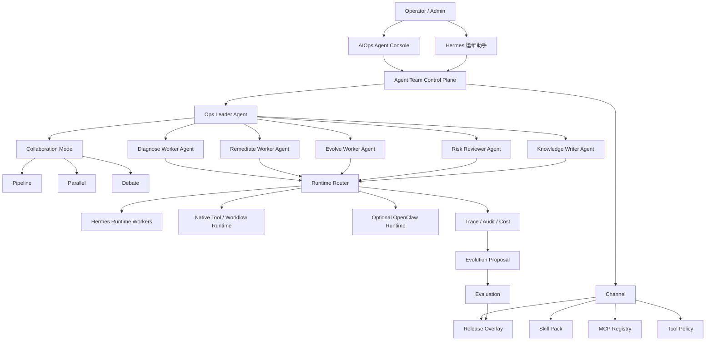

# AIOps Agent / Workflow 管理平台增强路线

## 背景

参考 RunbookHermes 的证据驱动、审批门禁、验证闭环和持续学习理念，AIOps Agent 后续仍然保持 Agent / Workflow 管理平台定位，不转向独立 Incident/Runbook 平台。RunbookHermes 的理念作为增强层，用来提升 Agent 执行质量、Workflow 闭环能力和持续进化能力。

后续演进重点不是替换当前产品骨架，而是把现有 Hermes Worker、Channel、Skill、MCP、Workflow、Policy、Trace、Evolution Proposal 和 Release Overlay 组织进 Agent / Workflow 管理主线。

当前系统已经具备以下基础：

- 三个 Hermes Worker：`diagnose`、`remediate`、`evolve`。
- Hermes Channel：诊断、修复编排、复盘进化。
- Skill Pack、MCP Server Registry、Tool Policy、Approval、Trace。
- Evolution Proposal、Evaluation、Release Version、Release Overlay Runtime。
- Hermes 控制台、Hermes 运维助手、进化提案页面。

下一阶段的关键不是“让模型更自由”，而是让系统从“能运行 Agent / Workflow”升级为“能治理 Agent 能力、增强 Workflow 闭环、沉淀执行经验”。

## 产品定位

目标定位：

```text
AIOps Agent = 可管理、可协作、可审计、可进化的 Agent / Workflow 管理平台
```

操作者不应该感知为“我在调用一个 Agent”，而应该感知为：

- 我有一个运维 Leader 负责拆解、调度和裁决。
- 我有多个专业 Worker 负责诊断、修复、复盘、审查、文档沉淀。
- 我可以选择 Agent Team 或 Workflow 模板完成告警诊断、巡检、修复审批、故障复盘。
- 平台会沉淀经验为 Skill，并通过受控发布机制让团队越用越懂业务。

## 设计原则

### 1. Leader-Worker 协作，而不是单 Agent 全包

复杂运维任务天然包含多个角色：

- Leader：拆解任务、选择协作模式、分配 Worker、汇总结论。
- Diagnose Worker：只读诊断、证据收集、影响面判断。
- Remediate Worker：修复方案、审批提交、任务编排。
- Evolve Worker：复盘、提案、Skill/Workflow/Policy 改进建议。
- Risk Reviewer：风险审查、变更窗口、回滚计划检查。
- Knowledge Writer：将处理过程沉淀为知识、SOP、Skill 草案。

### 2. Hermes 做长期记忆和经验沉淀

Hermes 是核心 Runtime，承担：

- 长期上下文和经验复用。
- Skill 生成、版本化和引用。
- 任务状态跟踪。
- 失败样本复盘和持续进化提案。

OpenClaw 类 Runtime 可以作为可选短任务 Runtime，但不作为当前主线依赖。

### 3. backend 始终是控制面

Hermes Worker 只负责推理，不直接连接生产数据库，不直接执行危险工具。

backend 继续负责：

- Tool API。
- PolicyGuard。
- Approval。
- Audit。
- Trace。
- Task / Workflow。
- Skill / MCP / Channel / Release 管理。

### 4. 自我进化必须受控

持续进化链路必须保持：

```text
Trace / Worker Run / Failure / Approval
  -> Evolve 分析
  -> Evolution Proposal
  -> Evaluation
  -> Admin Approval
  -> Release
  -> Runtime Overlay
  -> Rollback
```

任何自动生成内容不能绕过 evaluation、approval、publish 和 rollback。

## 目标架构



## 统一领域模型

| 对象 | 定义 | 当前映射 | 后续演进 |
| --- | --- | --- | --- |
| Runtime | Agent 实际推理/执行后端 | Hermes Worker、Native Tool Runtime | 可选接入 OpenClaw 类短任务 Runtime |
| Channel | 能力通道，绑定 Runtime、模型、工具、Skill、MCP、Policy | Hermes Channels | 成为 Agent/Team 的能力选择入口 |
| Agent | 一个角色和职责 | Hermes 诊断/修复/复盘 Agent | 扩展为 Leader/Worker 角色体系 |
| Team | 一组 Agent 的协作模板 | 暂无一等对象 | 新增 Team Template 和 Team Run |
| Skill | 可复用经验资产 | Skill Pack Registry | 支持来源、版本、评估、发布、回滚 |
| MCP | 外部能力注册中心 | MCP Server Registry | 受控导入 Tool API，纳入审批审计 |
| Workflow | 可执行运维流程 | Workflow Templates | 支持 Team 自动选择和编排 |
| Policy | 安全和工具边界 | Tool Policy / Permission Boundary | 与 Team、Channel、Release 联动 |
| Trace | 证据链 | Agent Execution、Worker Run、Audit | 支撑复盘、提案、成本和治理 |
| Release | 可控运行态版本 | Release Version / Overlay | 影响 Skill/MCP/Workflow/Policy 的 effective config |

## 协作模式

### Pipeline：流水线

适合有明确步骤的任务。

示例：

```text
告警输入
  -> Diagnose Worker 收集证据
  -> Risk Reviewer 判断风险
  -> Remediate Worker 生成修复计划
  -> Approval
  -> Workflow 执行
  -> Evolve Worker 复盘
```

### Parallel：并行

适合批量巡检、批量服务器分析、批量日志摘要。

示例：

```text
50 台服务器巡检
  -> Leader 按服务器分组
  -> 多个 Diagnose Worker 并行执行
  -> Leader 汇总异常
  -> Risk Reviewer 排序风险
```

### Debate：讨论裁决

适合上线评估、修复方案选择、策略调整。

示例：

```text
是否发布某个 Skill 更新
  -> Evolve Worker 给出收益
  -> Risk Reviewer 给出风险
  -> Diagnose Worker 给出历史证据
  -> Leader 汇总并提出建议
  -> Admin 决策
```

## 产品化主线 P1-P6

### P1：产品定位与信息架构收敛

目标：

- 把系统叙事从“Agent 列表 + Workflow 列表”升级为“Agent / Workflow 管理平台 + Hermes 增强能力层”。
- 让用户理解 Agent、Channel、Skill、MCP、Workflow、Policy、Trace、Release 的关系。

工作项：

- 更新产品文案和文档：
  - AIOps Agent。
  - Agent / Workflow 管理平台。
  - Hermes 增强能力层。
  - Hermes 是长期记忆和经验沉淀 Runtime。
- Hermes 控制台重组为：
  - 总览。
  - Teams。
  - Channels。
  - Agents。
  - Skills。
  - MCP Servers。
  - Tool Policy。
  - Runtime Evidence。
  - Releases。
- 在控制台增加能力关系图：
  - Team -> Agent -> Channel -> Worker -> Skill/MCP/Policy -> Release。
- 明确 OpenClaw 类 Runtime 是可选适配，不阻塞主线。

验收：

- 管理员可以从一个页面看懂当前有几支 AI 运维团队。
- 每个 Agent 的 Channel、Worker、Skill、MCP、Policy、Release 都可追溯。
- 页面和文档不再把 Hermes 作为隐藏 Runtime，而是作为可管理能力。

实施切片：

- P1a：产品文案收敛，把平台描述升级为“Agent / Workflow 管理平台 + Hermes 增强能力层”。
- P1b：在 Hermes 控制台顶部增加派生 Team Overview，不新增数据库表。
- P1c：用现有 Channel / Agent Binding / Worker / Skill / MCP / Release 数据展示团队能力覆盖。
- P1d：明确 Team 当前是只读产品模型，P2 再升级为 `agent_teams` 和 `agent_team_runs` 一等对象。

P1 需要避免：

- 不改现有执行器。
- 不新增 Team Run 状态机。
- 不改变 Hermes Runtime Router。
- 不开放新的 MCP tool execution。
- 不让自我进化自动影响生产。

### P2：Agent Team 与 Leader-Worker 编排

目标：

- 新增 Team 一等对象。
- 支持 Leader-Worker 协作模式。

工作项：

- 新增数据模型：
  - `agent_teams`
  - `agent_team_members`
  - `agent_team_runs`
  - `agent_team_run_steps`
- 新增 Team Template：
  - 告警诊断与修复团队。
  - 服务器巡检团队。
  - 变更风险审查团队。
  - 故障复盘进化团队。
- 新增 Leader Agent：
  - 输入任务目标。
  - 选择协作模式。
  - 分配 Worker。
  - 汇总输出。
- 支持三种编排：
  - `pipeline`
  - `parallel`
  - `debate`
- Team Run 写入 trace，并关联 worker runs、approvals、tasks、proposals。

验收：

- 操作者可以选择 Team Template 发起任务。
- Team Run 可以展示 Leader 决策、Worker 输出和最终结论。
- Pipeline 模式至少跑通“告警诊断 -> 修复建议 -> 审批提交”。
- Parallel 模式至少跑通“多服务器状态摘要”。
- Debate 模式至少跑通“发布建议讨论”。

实施切片：

- P2a：新增 Team 一等对象：
  - `agent_teams`
  - `agent_team_members`
  - `agent_team_runs`
  - `agent_team_run_steps`
- P2b：默认初始化三支团队：
  - 告警诊断与修复团队：`pipeline`
  - 巡检复盘团队：`parallel`
  - 变更风险审查团队：`debate`
- P2c：控制台优先读取 `/api/agent-teams`，后端未迁移时回退 P1 派生视图。
- P2d：支持从团队卡片发起最小 Team Run。
- P2e：Team Run 当前记录 Leader plan 和 Worker step evidence，不直接调用生产工具。

P2 当前边界：

- Team Run 是编排证据和状态对象。
- Worker step 会关联 Agent、Channel、Worker role。
- 真实 Hermes Worker 执行、审批任务嵌入和 Skill Candidate 生成留给下一切片。
- 不绕过现有 Tool Approval / Workflow / PolicyGuard。

### P3：Workflow Runbook 化增强

目标：

- 保持 Workflow 作为平台核心编排对象。
- 吸收 RunbookHermes 的证据优先、风险门禁、审批执行、验证复盘理念。
- 让 Workflow 模板从“节点串联”升级为“诊断-证据-风险-审批-执行-验证-复盘”的可审计闭环。

工作项：

- 保留旧默认 Workflow，不破坏已有自动化。
- 增强 Hermes Workflow Template：
  - Hermes 告警诊断与修复闭环。
  - Hermes 故障诊断与审批修复。
  - Hermes 巡检复盘与优化建议。
- 每个模板节点补充 Runbook metadata：
  - `runbookPhase`
  - `evidenceRequired`
  - `riskGate`
  - `approvalRequired`
  - `verificationRequired`
  - `outputKey`
- Workflow `agent_configs` 补充：
  - `hermesEnhanced`
  - `runbookDriven`
  - `teamType`
  - `collaborationMode`
  - `runbookPattern`
  - `stages`
  - `safety`
- Workflow 执行时把 Runbook metadata 注入 Agent context。
- Workflow node result 写入 Runbook metadata，方便任务详情、trace 和复盘读取。
- Workflow 列表展示 Hermes-enhanced、协作模式、阶段数、审批/验证门禁摘要。

验收：

- 管理员能在 Workflow 页面看到哪些模板已经 Hermes-enhanced。
- Hermes 增强模板包含明确的证据、风险、审批、验证阶段。
- 执行任务时每个节点上下文包含 runbook metadata。
- `node_results` 中能追溯节点所属阶段、证据要求和门禁要求。
- 旧 Workflow 仍按原逻辑执行。

实施切片：

- [x] P3a：模板元数据增强和旧模板自动升级。
- [x] P3b：执行器透传 Runbook metadata。
- [x] P3c：Workflow 列表展示 Hermes-enhanced 摘要。
- [x] P3d：任务详情展示节点 Runbook 阶段和证据要求。
- [x] P3e：把审批/验证节点与现有 Tool Approval / Task 状态做只读聚合。

P3 当前边界：

- 不新增独立 Runbook 主对象。
- 不让 Workflow 自动绕过审批执行危险工具。
- 不重写 Workflow 执行状态机。
- 先把 Runbook 语义固化到模板、上下文和结果中。

### P4：Skill 运维语义化

目标：

- 把 Skill 从普通 prompt/配置升级为可版本化的运维技能包。

工作项：

- Skill 增加运维语义：
  - 适用场景。
  - 输入上下文要求。
  - 证据要求。
  - 推荐 MCP/Tool。
  - 风险等级。
  - 审批要求。
  - 验证方式。
  - 回滚建议。
  - 版本状态。
- Channel 能力摘要展示 Skill 覆盖。
- Workflow 节点可以声明推荐 Skill。
- Hermes Runtime 构造 prompt 时注入有效 Skill 摘要。

验收：

- Agent/Channel 页面能看懂某个 Skill 适合处理什么问题。
- Workflow 模板能引用 Skill。
- Skill 发布/回滚仍通过 Release 机制受控。

P4 实施切片：

- [x] P4a：Skill 增加运维语义字段：适用场景、输入上下文、证据、推荐工具/MCP、风险、审批、验证、回滚、输出契约和版本状态。
- [x] P4b：Skill API、Channel 解析、Hermes Runtime prompt 注入和能力包导入导出贯通语义字段。
- [x] P4c：Hermes 团队控制台展示 Channel Skill 覆盖摘要，包括风险、审批、场景、证据、推荐工具、MCP、验证和回滚。
- [x] P4d：Workflow 节点声明 recommended Skill，并在模板编辑器/任务详情中展示引用关系。
- [x] P4e：Skill 语义与 Release/Evaluation 进一步联动，形成发布前评估和回滚边界。

P4e 收敛结果：

- Evaluation 增加 Skill/Workflow 语义守卫：
  - Skill 提案必须明确目标 Skill，并检查风险、审批、验证方式、输出契约和回滚建议。
  - Workflow 模板提案必须明确目标 Workflow，并检查节点 recommended Skill 覆盖和缺失 Skill。
  - 评估摘要写入 `semanticGuard`，包含受影响 Skill/Workflow、缺失 Skill、发布守卫模式、回滚边界和覆盖率。
- Release 发布门禁增强：
  - Skill/Workflow 提案必须使用带 `semanticGuard` 的最新通过评估。
  - 发布前必须存在有效回滚边界。
  - release payload 保存最新评估摘要和 semantic guard，便于回滚与审计。
- 前端 Evolution Proposal 详情页展示：
  - 语义分。
  - Skill 语义发布守卫。
  - 受影响 Skill/Workflow、缺失 Skill、回滚边界、节点 Skill 覆盖。

P4 当前边界：

- 不改变现有 Workflow 执行器选择 Agent 的方式。
- 不开放 MCP tool execution，仅把 MCP 作为 Skill 推荐连接器和 Channel 能力摘要。
- Skill 的运行态生效仍通过 Channel 绑定、已发布 release overlay 和 Hermes Runtime 注入；发布/回滚继续走 Release 机制。
- P4e 只做发布前评估和版本 payload 边界，不把 structured patch 直接写回 Skill/Workflow 源表。

### P5：Execution Evidence 证据链

目标：

- 让每次 Agent / Workflow / Team 执行都有结构化证据链。

工作项：

- 标准化执行证据字段：
  - `input`
  - `context`
  - `evidence`
  - `hypothesis`
  - `riskLevel`
  - `plannedActions`
  - `approvalId`
  - `taskId`
  - `verificationResult`
  - `traceId`
- Agent 执行详情展示证据和风险。
- Workflow 任务详情展示节点证据。
- Hermes 控制台展示 Team Run、Workflow Run、Trace、Approval 的关联链。

验收：

- 任意一次执行能回答“为什么这么判断、做了什么、结果如何”。
- 证据链能支撑复盘和 Evolution Proposal。

P5 实施切片：

- [x] P5a：标准化 `executionEvidence` 摘要，不改表结构，写入 Agent execution metadata 与 Workflow node result metadata。
- [x] P5b：Correlation Trace 页面聚合 executionEvidence，串联 Agent / Workflow / Team / Approval / Task。
- [x] P5c：Evolution Proposal evidence snapshot 优先消费 executionEvidence，而不是只扫 trace 文本。
- [x] P5d：Team Run 视图补充 Hermes worker、Channel、Skill、MCP、Release overlay 的证据链。

P5a 收敛结果：

- 新增 `execution.evidence.v1` 摘要结构：
  - `input`
  - `context`
  - `evidence`
  - `hypothesis`
  - `riskLevel`
  - `plannedActions`
  - `approvalId`
  - `taskId`
  - `verificationResult`
  - `traceId`
- Workflow 节点执行成功/失败都会把 `executionEvidence` 写入 node result metadata。
- Agent 测试执行、Evolution proposal 生成、旧 LLM Agent 执行记录都会把 `executionEvidence` 写入 agent execution metadata。
- Tasks 节点结果页展示执行证据链摘要。
- Agents 执行历史展示证据和风险摘要。

P5a 当前边界：

- 不新增 evidence 表，先复用现有 JSON metadata。
- `hypothesis`、`plannedActions`、`verificationResult` 先用确定性文本/trace 提取，后续 P5c 再让 Hermes/Evolution 消费并校正。
- 旧历史记录不会自动回填，只有新执行产生标准化 evidence。

P5b 收敛结果：

- 新增统一 `getCorrelationTrace(correlationId)` 服务，API 与 Tool API 复用同一条聚合逻辑。
- Correlation Trace 聚合范围扩展为：
  - Hermes Session
  - Agent Execution
  - Tool Approval
  - Task / Workflow node result
  - Agent Team Run
  - Hermes Worker Run
  - Audit Log
- Correlation Trace 返回 `correlation.executionEvidence.v1` 摘要：
  - `counts`
  - `riskLevels`
  - `toolCalls`
  - `approvalIds`
  - `taskIds`
  - `traceIds`
  - `releaseOverlayVersionIds`
  - `latestEvidenceAt`
- Hermes 运维助手闭环区展示执行证据链摘要，操作者可以在一个入口看到 Agent / Workflow / Team / Approval / Task 的关联证据。

P5b 当前边界：

- 仍不新增独立 evidence 表，查询依赖现有 JSON metadata 与 correlationId 模糊匹配。
- Team Run / Worker Run 当前先纳入链路计数和关联展示，详细证据展开留给 P5d。
- Evolution Proposal 尚未改为优先消费结构化 evidence，留给 P5c。

P5c 收敛结果：

- Evolution Proposal 的 `evidence_refs` 升级为 `evolution.evidence.v2`。
- Evidence snapshot 优先包含：
  - `executionEvidence`
  - `executionEvidenceSummary`
  - `correlationTraceSummary`
- 生成 proposal 时，如果传入 `correlationId`，优先复用 P5b 的 Correlation Trace 聚合结果。
- 未传入 `correlationId` 时，按时间窗口从 Agent execution metadata 与 Workflow task node result 中抽取 `execution.evidence.v1`。
- Hermes Evolve prompt 明确要求优先引用结构化 evidence，而不是自由文本 trace。
- Evaluation evidence score 识别 `executionEvidence`，并把结构化 evidence 纳入 replay samples。

P5c 当前边界：

- 仍然复用 `evidence_refs` JSON 字段，不新增独立 evidence 表。
- Proposal 生成质量仍取决于 Hermes Evolve 对 evidence snapshot 的理解，后续可以补 deterministic evidence-to-proposal scaffold。
- 旧 proposal 不自动回填 `evolution.evidence.v2`。

P5d 收敛结果：

- Team Run 输出中固化 `team.executionEvidenceChain.v1`。
- 每个 Team Run step 的 metadata 写入 `team.stepEvidence.v1`。
- Evidence chain 覆盖：
  - Hermes Worker 健康状态与最近运行
  - Channel 绑定
  - Skill Pack
  - MCP Server
  - Tool allowlist
  - active Release overlay
- Team Console 最近运行卡片展示 Team Run evidence chain 摘要。

P5d 当前边界：

- 当前 Team Run 仍是 dry-run 编排记录，Worker 真实执行结果会在后续 P6/P7 类阶段接入。
- 旧 Team Run 不自动回填 evidence chain。
- Release overlay 展示为运行态快照，不在 Team Run 页面执行发布或回滚操作。

### P6：Approval & Verification 闭环增强

目标：

- 把安全门禁吸收到现有审批和任务体系，允许 Hermes 参与修复但不能失控执行。

工作项：

- 动作风险分类：
  - `read_only`
  - `low_risk`
  - `high_risk`
  - `destructive`
- 高风险动作必须审批。
- 执行前生成：
  - impact。
  - rollback。
  - validation。
- 执行后强制验证：
  - 命令验证。
  - 指标验证。
  - 日志验证。
  - 人工确认。

验收：

- 高风险 prompt 不能绕过审批。
- 修复执行后必须有验证结果。
- 验证失败能进入复盘和改进提案。

P6 实施切片：

- [x] P6a：审批请求标准化 `approval.safetyPlan.v1`，展示 impact / rollback / validation。
- [x] P6b：审批执行后自动生成或关联 verification requirement。
- [x] P6c：验证失败自动进入复盘入口和 Evolution Proposal 候选。
- [x] P6d：高风险/破坏性 prompt 增强拦截和审计说明。

P6a 收敛结果：

- Tool approval 创建时在输入中附加 `safetyPlan`：
  - `riskClass`
  - `approvalRequired`
  - `verificationRequired`
  - `impact`
  - `rollback`
  - `validation`
- 审批执行时会剥离 `safetyPlan`，避免影响工具业务参数。
- 工具审批页展示安全计划，审批人可以在批准前确认影响、回滚和验证要求。

P6b 收敛结果：

- 审批执行成功后，如果 `safetyPlan.verificationRequired=true`，会在 `execution_result.data.verificationRequirement` 中写入：
  - `schemaVersion=approval.verificationRequirement.v1`
  - `approvalId`
  - `toolName`
  - `riskLevel`
  - `correlationId`
  - `taskId`
  - `method`
  - `expectedStatus`
  - `validationPlan`
- 如果执行结果或输入中能识别 `taskId`，验证方式为 `verify_remediation`。
- 如果未关联任务，验证方式为 `manual_confirmation`，用于承接命令输出、指标、日志和人工确认。
- 工具审批页在执行结果旁展示验证要求卡片，审批人可以直接看到后续验证动作。
- 当前不新增独立 verification 表；P6c 再把验证失败接入复盘入口和 Evolution Proposal 候选。

P6c 收敛结果：

- `verify_remediation` 返回 `verified=false` 时，自动创建或复用一条 Evolution Proposal 候选：
  - `source=verification_failure`
  - `source_ref=verify_remediation:{taskId}`
  - `status=draft`
  - `type=workflow_template_update`
  - `evidence_refs.schemaVersion=verification.failure.evidence.v1`
- 候选提案包含：
  - taskId / workflowId / correlationId
  - expectedStatus / actualStatus
  - failedNodes
  - task snapshot
  - 建议的工作流、验证策略和回滚说明改进方向
- `verify_remediation` 工具结果会回写 `retrospectiveCandidate.proposalId` 和跳转 route。
- 工具审批详情页能从执行结果中识别 `proposalId`，提供“查看提案”快捷入口。
- Evolution Proposal 页面支持 `?proposalId=` 深链，便于从验证失败直接进入复盘候选。
- 当前边界：P6c 只创建候选，不自动评估、不自动审批、不自动发布；后续由 Evaluation / Review / Release 闭环处理。

P6d 收敛结果：

- Tool API 增加 `tool.safetyReview.v1` 输入安全扫描：
  - 破坏性文件系统/磁盘/数据库/集群批量删除。
  - 绕过审批、绕过审计、绕过策略的 prompt。
  - 服务中断、集群变更、网络变更、远程脚本执行等高风险动作。
- 命中破坏性或策略绕过：
  - 直接 `denied`。
  - `riskLevel=destructive`。
  - 不创建审批单。
  - 返回和审计日志写入 `safetyReview`。
- 命中高风险但非破坏性：
  - 自动升级为 `approval_required`。
  - `riskLevel=high_risk`。
  - 审批单 input 固化 `safetyReview`。
  - 执行审批时剥离 `safetyReview`，不污染工具业务参数。
- 工具审批详情页展示“安全审查说明”，包括命中策略、字段、摘录、处置原因和操作建议。
- Hermes Runtime system prompt 明确禁止绕过审批、审计、工具策略和 safety review；破坏性动作必须转成 proposal-only plan。
- 当前边界：这是确定性规则扫描，不替代后续更细粒度的 Tool Policy DSL、环境级变更窗口和 CMDB 影响面计算。

### P7：Evolution 反馈驱动进化

目标：

- 让自我进化来自真实执行反馈，而不是泛化建议。

提案来源：

- Workflow 失败。
- Tool 调用失败。
- 审批被拒绝。
- 验证失败。
- 人工修改修复方案。
- 同类问题重复发生。
- 复盘 Agent 输出建议。

提案类型：

- Skill 改进。
- Workflow 模板改进。
- MCP Server 建议。
- Tool Policy 调整。
- Prompt / System Instruction 优化。
- Runbook 文档更新。

闭环：

```text
执行反馈
  -> Evolve Agent 分析
  -> Evolution Proposal
  -> Review Queue
  -> Admin 审批
  -> Release Version
  -> 回写 Skill / Workflow / Policy effective config
```

验收：

- 每个 proposal 能追溯来源执行和失败原因。
- 发布前可评估，发布后可回滚。

P7 实施切片：

- [x] P7a：失败反馈确定性生成 Evolution Proposal 候选。
- [x] P7b：Review Queue 运营视图增强，展示来源、失败原因、生成提案、评估状态和发布价值。
- [x] P7c：同类问题聚合和重复发生识别，避免一事一提案的噪声。
- [x] P7d：复盘 Agent 消费候选证据，补充结构化 patch、评估计划和风险说明。
- [x] P7e：Proposal -> Evaluation -> Approval -> Release 的运营仪表盘收口。

P7a 收敛结果：

- `failure_review` 持续进化任务不再只入队失败反馈，会自动创建或复用 `source=feedback_failure` 的 proposal 候选：
  - Hermes Worker failed / fallback。
  - Agent execution error。
  - Workflow task failed / error。
- `rejected_approval_review` 会为被拒绝的工具审批创建或复用 tool policy 方向的 proposal 候选。
- Review Queue 项会回写：
  - `generated_proposal_id`
  - `status=proposal_generated`
  - `reviewed_at`
- 生成的 proposal 使用 `feedback.failure.evidence.v1`，包含：
  - sourceType/sourceId
  - reason
  - priority
  - correlationId
  - 原始失败证据快照
- Proposal 类型按反馈来源确定性映射：
  - worker_run -> `skill_update`
  - agent_execution -> `prompt_update`
  - task -> `workflow_template_update`
  - tool_approval -> `tool_policy_update`
- Evolution Proposal 页面持续进化队列显示已生成提案，并支持从队列项直接跳转到 proposal。
- 当前边界：P7a 只生成候选，不自动评估、审批或发布；P7b/P7c 继续增强运营视图和重复问题聚合。

P7b 收敛结果：

- Review Queue API 返回运营摘要：
  - 原始来源、失败原因、优先级和队列状态。
  - 生成的 Evolution Proposal 摘要，包括 title/type/status/priority。
  - 最新 deterministic evaluation 摘要，包括 status/score/passed/finding counts。
  - `review_value` 只读推荐，包括 queued/candidate/needs_evaluation/needs_work/review/promote。
- Evolution Proposal 页面持续进化队列增强为运营卡片：
  - 显示来源类型、失败原因、队列状态和优先级。
  - 展示生成提案标题、类型、状态、评估分和推荐动作。
  - 保留 “打开提案” 跳转，便于从反馈来源进入 proposal 详情。
- 当前边界：P7b 不做自动评估、自动审批、自动发布；`promote` 只是运营建议，真正进入审批仍由后续任务或管理员触发。

P7c 收敛结果：

- Review Queue 增加确定性聚合字段：
  - `cluster_key`：按来源类型和归一化失败原因生成的稳定 signature。
  - `normalized_reason`：去掉 UUID、长数字、时间戳、URL 等噪声后的可读聚合依据。
- 失败反馈入队时会先查找同 `cluster_key` 的代表 proposal：
  - 如果存在未 rejected/archived/published 的代表 proposal，则新队列项复用它。
  - 如果不存在代表 proposal，才创建新的 feedback-driven proposal。
  - 每条失败仍保留自己的 queue item 和原始 evidence，避免丢证据。
- Review Queue API 返回 `cluster` 摘要：
  - occurrence count
  - linked proposal count
  - first/last seen
  - 最近样本
- Evolution Proposal 页面展示“同类重复 N 次 / M 个提案”，帮助操作者识别重复问题和提案噪声。
- 当前边界：P7c 只对新入队或再次扫描到的反馈写入 cluster；历史无 cluster 的旧数据不做破坏性回填。已 rejected/archived/published 的 proposal 不作为复用代表。

P7d 收敛结果：

- 新增 proposal enrichment 能力：
  - 手动入口：`POST /api/evolution-proposals/:id/enrich`。
  - 自动入口：持续进化任务 `proposal_enrichment`，默认每小时第 10 分钟运行。
- Hermes 复盘进化 Agent 会消费候选 proposal、Review Queue、cluster、已有 evidence 和事件记录，补齐：
  - Problem evidence
  - Proposed structured change
  - Evaluation plan
  - Risk and rollback
  - Release guard
- enrichment 会更新 proposal：
  - proposal body 追加 P7d enrichment 区块。
  - evidence_refs 写入 `evolution.proposalEnrichment.v1`。
  - target_descriptor 重新生成/校验 `evolution.patch.v1` structured patch。
  - risk_notes 增加 enrichment 模式和治理边界。
  - 记录 `enriched` event、agent execution 和 Hermes session。
- Hermes 外部调用失败时不让队列卡死：
  - 记录 agent execution error。
  - 使用 deterministic fallback 生成最小可评估 enrichment。
  - event metadata 标明 `mode=deterministic_fallback` 和 error。
- Evolution Proposal 页面增加“复盘增强 / Enrich”操作。
- 当前边界：P7d 只增强候选提案，不自动进入 eval_passed、approval_pending 或 published；是否推进仍由评估和审批决定。

P7e 收敛结果：

- 新增只读 lifecycle summary：
  - stage：candidate / evaluation / approval / release / published / closed。
  - next_action：enrich / evaluate / fix_findings / submit_approval / approve / publish / monitor / none。
  - readiness_score：按 enrichment、structured patch、evaluation、approval、release 计算。
  - blockers：needs_enrichment、invalid_structured_patch、missing_evaluation、evaluation_failed、awaiting_admin_approval。
  - signals：enriched、patch_valid、evaluation_passed、approval_ready、approved、published、active_release_id。
- Evolution Proposal API 的列表和详情都返回 `lifecycle_summary`，前端无需重新推断链路状态。
- Evolution Proposal 页面增加闭环状态面板：
  - 显示就绪度。
  - 显示下一步动作。
  - 显示增强、Patch、评估、审批、批准、发布信号灯。
  - 显示阻塞原因。
- Proposal 列表卡片也显示 stage / readiness / next action，便于批量扫视。
- 当前边界：P7e 只做运营视图收口，不自动改变 proposal 状态，不绕过评估、审批或发布规则。

### P8：Agent / Workflow 管理台产品化

目标：

- 保持 Agent / Workflow 管理平台定位，同时让管理台能表达团队、能力、风险和执行质量。

工作项：

- Agent 管理页增强：
  - 所属 Team。
  - 绑定 Channel。
  - 可用 Skill。
  - 可用 MCP。
  - 可用 Tool。
  - 最近执行效果。
  - 风险权限。
- Workflow 管理页增强：
  - 是否 Hermes-enhanced。
  - 使用哪些 Agent Team。
  - 需要哪些 Skill/MCP。
  - 是否包含审批。
  - 是否包含验证。
  - 最近成功率。
- Hermes 控制台增强：
  - Team 拓扑。
  - Channel 健康。
  - Skill 覆盖。
  - MCP 健康。
  - 执行质量。
  - Evolution 反馈。

验收：

- 管理员不需要理解底层 Hermes 细节，也能管理能力。
- Agent/Workflow/Hermes 控制台之间的关系一致。

P8 实施切片：

- [x] P8a：Agent 管理页能力摘要，展示 Team、Channel、Skill、MCP、Tool、风险边界和最近执行质量。
- [x] P8b：Workflow 管理页增强，展示 Hermes-enhanced、Agent Team、Skill/MCP 依赖、审批/验证和最近成功率。
- [ ] P8c：Hermes 控制台产品化汇总，把 Team 拓扑、Channel 健康、Skill 覆盖、MCP 健康、执行质量和 Evolution 反馈组织成统一管理视图。

P8a 收敛结果：

- 新增 Agent capability summary：
  - teams：Agent 所属 Team，以及通过 Channel type 隐式参与的 Team。
  - channel：绑定的 Hermes Channel、Channel type 和健康状态。
  - skills：Channel 绑定且启用的 Skill 数量和名称摘要。
  - mcpServers：Channel 绑定且启用的 MCP Server 数量、健康/异常数量和名称摘要。
  - tools：Channel 允许的 Tool 数量、高风险 Tool 数量和名称摘要。
  - risk：autonomy_level、tool_policy_id、是否需要审批。
  - executionQuality：最近 10 次执行的成功率、最后状态、最后执行时间和平均耗时。
- `/api/agents` 列表和 `/api/agents/:id` 详情都返回 `capability_summary`，前端无需重复推断。
- Agent 管理页卡片增加紧凑能力摘要，详情页增加完整能力摘要面板。
- 当前边界：P8a 只做只读管理可视化，不新增 Skill/MCP/Tool 绑定操作，不改变 Agent 执行逻辑或权限策略。

P8b 收敛结果：

- 新增 Workflow capability summary：
  - hermesEnhanced / runbookDriven：统一识别 Hermes 增强工作流和 Runbook 驱动工作流。
  - collaborationMode / runbookPattern：展示协作模式和 Runbook 模式。
  - agentTeams：根据节点 Agent 和 Channel type 推断参与的 Team。
  - agents：列出工作流节点使用的 Agent，以及对应 runtime、Channel 和 Channel type。
  - skills：合并节点/阶段显式推荐 Skill 与 Agent Channel 绑定 Skill。
  - mcpServers：合并节点/阶段显式推荐 MCP 与 Agent Channel 绑定 MCP，并标记异常数量。
  - gates：统计审批门禁和验证门禁。
  - executionQuality：最近 20 次任务成功率、失败/运行中数量、最后状态、最后执行时间和平均耗时。
- `/api/workflows` 列表和 `/api/workflows/:id` 详情都返回 `capability_summary`。
- Workflow 管理页卡片增加能力摘要，展示模式、Team、Agent、Skill、MCP、执行质量、门禁和最近状态。
- 当前边界：P8b 只做只读管理可视化，不新增 Workflow 编排规则，不自动改变审批/验证策略，不改变执行器。

### P9：评估与回归测试体系

目标：

- 防止 Skill / Workflow / Policy 进化后变差。

工作项：

- 增加 Eval Dataset：
  - 典型告警样本。
  - 典型服务器故障。
  - 典型 Kubernetes 问题。
  - 历史失败案例。
  - 审批拒绝案例。
  - 验证失败案例。
- 评估指标：
  - 诊断是否命中。
  - 是否引用证据。
  - 是否误判风险。
  - 是否建议危险动作。
  - 是否生成验证步骤。
  - 是否符合审批策略。
  - 是否复用正确 Skill。

验收：

- 运行态变更发布前必须经过评估。
- 回滚有明确触发条件。

### P10：企业级部署、治理和持续运营

目标：

- 让 Agent / Workflow 管理平台具备真实企业可用的部署、安全、治理和运营边界。

工作项：

- 生产部署：
  - frontend nginx 静态生产包。
  - backend 生产 build。
  - 三 Hermes Worker compose 固化。
  - 网络 alias、healthcheck、volume、backup 固化。
- 多环境治理：
  - dev。
  - staging。
  - production。
  - shadow run。
  - staging replay。
- Release 治理：
  - change window。
  - mandatory rollback plan。
  - high-risk release 双人审批。
  - release impact analysis。
- 数据持久化：
  - Hermes Worker 不存业务数据。
  - backend 持久化 trace、run、proposal、release、skill、mcp、team。
  - 备份恢复演练。
- 安全运营：
  - viewer/operator/admin 权限边界。
  - 危险 prompt 拦截。
  - 高风险工具默认审批。
  - 审计导出。

验收：

- 删除重建容器后服务仍可恢复。
- 备份恢复演练有记录。
- 生产发布前可跑 staging replay。
- 高风险变更没有 rollback plan 不能发布。
- 所有 Team Run 都可追溯到 trace、approval、tool call、release version。

## 最小可用版本

建议先做一个最小闭环，而不是一次性铺开全部能力：

```text
P1 信息架构收敛
  -> P2 Team Template + Pipeline 编排
  -> P3 Workflow Runbook 化增强
  -> P4 Skill 运维语义化
  -> P5 Execution Evidence
```

最小可用版本验收：

- 有“告警诊断与修复团队”模板。
- 用户能从 Hermes 运维助手或 Team 页面发起一次 Team Run。
- 工作流模板能明确诊断、证据、风险、审批、验证、复盘阶段。
- 输出能关联 evidence、approval、task、trace。
- 复盘后能生成可审批的 Skill / Workflow / Policy 改进建议。

## 与现有阶段的关系

现有阶段 22-30 是技术底座：

- 22-23：三 Hermes Worker 和观测。
- 24-27：Evolution Proposal、Evaluation、Release、持续进化。
- 28：Capability Control Plane。
- 29：结构化 Evolution Patch。
- 30：Release Overlay Runtime。

本路线是产品化主线：

- P1/P8 承接阶段 28。
- P2 新增 Team Orchestrator。
- P3 让 Workflow 吸收 RunbookHermes 的证据、风险、审批、验证语义。
- P4-P7 承接阶段 24-30，让 Skill 经验沉淀和 Evolution 进入受控运行态。
- P10 承接已有阶段 32 多环境、灰度和治理。

## 推荐推进顺序

第一批：

```text
P1a：文案和概念模型收敛
P1b：Hermes 控制台 Team/Channel/Agent/Skill/MCP/Release 关系图
P2a：Team Template 数据模型和只读页面
P2b：Pipeline Team Run 最小执行
P3a：Workflow 模板 Runbook metadata
P3b：执行器透传 Runbook metadata
```

第二批：

```text
P3c：Workflow 页面 Hermes-enhanced 摘要
P3d：任务详情 Runbook 阶段展示
P4a：Skill 运维语义字段
P4b：Skill Runtime 注入和导入导出
P4c：Channel 控制台 Skill 能力摘要
P5a：Execution Evidence 标准化
```

第三批：

```text
P6a：Approval & Verification 闭环
P7a：失败反馈生成 Evolution Proposal
P8a：Agent / Workflow 管理台产品化
P9a：Eval Dataset 与发布前评估
P10a：生产治理、备份恢复、发布审计
```

## 风险与边界

- 不让 Worker 直接执行生产工具。
- 不让自我进化自动发布生产变更。
- 不把 OpenClaw 作为当前主线依赖。
- 不在没有 Team/Trace/Approval 的情况下开放 MCP tool。
- 不让 UI 只展示“炫技协作”，必须展示证据、风险、审批和结果。

## 一句话目标

把 AIOps Agent 从“能运行多个 Agent 和 Workflow 的平台”升级为“能治理 Agent 能力、增强 Workflow 闭环、沉淀运维经验的平台”：

```text
团队可配置
能力可治理
执行可审计
经验可沉淀
进化可发布和回滚
```
