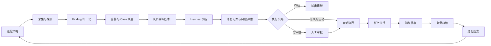

# Autonomous Ops Loop Plan

## 背景

当前平台已经有资产、拓扑、指标采集、告警接入、Hermes Channel、审批、任务执行、验证、复盘和进化提案等能力，但这些能力仍然偏“模块化入口”。要成为完整可闭环的 AIOps 系统，需要补齐一个常驻的自动运维控制器，把巡检、发现问题、诊断、方案生成、审批执行、验证和复盘串成统一流程。

## 当前已有能力

- 资产与连接：主机、网络设备、Kubernetes 集群、服务器分组、Kubernetes 承载主机关联、全局拓扑。
- 自动采集：服务器指标每 5 分钟采集，数据库定期维护，工作流定时任务。
- 告警接入：Prometheus、Zabbix、Grafana、云厂商和通用 Webhook，支持告警去重和告警到工作流映射。
- 运维推理：Hermes 诊断、修复编排、复盘进化三个 Channel/Worker。
- 安全闭环：Tool approval、任务执行、`verify_remediation`、Case 时间线、Evolution Proposal。
- 运维执行：工作流、服务器命令、网络设备巡检、Kubernetes 资产同步和 Kite 控制台。

## 主要缺口

- 缺少统一的自动巡检策略模型：目前有采集和定时任务，但没有按资产层级定义巡检包、频率、阈值、风险等级和处置模式。
- 缺少统一的 Finding 模型：指标异常、K8s 事件、网络巡检异常、告警 Webhook 还没有先归一成同一种“问题发现”结构。
- 缺少自动 Case Controller：告警、Finding、Hermes Session、Approval、Task、Verification、Evolution 虽可关联，但不是由一个控制器持续驱动状态流转。
- 缺少拓扑影响分析的自动决策：拓扑已经更接近现实资产，但还需要用拓扑判断影响范围、关联根因和修复优先级。
- 缺少“自动/需审批/禁止”的策略矩阵：不同资产、工具、风险等级、用户角色需要明确执行边界。

## 目标闭环

## 信息架构收口

自动化闭环应集中在“运维工作台”里，而不是散落在多个页面：

- 发现问题：展示巡检 Finding、外部告警、异常趋势。
- 梳理问题：展示 Case、拓扑影响、关联资产、证据。
- 找到方案：调用 Hermes 诊断和修复编排 Channel。
- 执行修复：根据策略自动、审批后执行或只输出建议。
- 验证复盘：任务状态、验证结果、复盘总结、进化提案。

## 阶段计划

### P1：拓扑和资产关系收口

- 全局拓扑只展示现实资产：主机、网络设备、Kubernetes 集群、关键平台资源。
- Kubernetes 内部对象留在集群详情/Kite，不进入全局拓扑。
- Kubernetes 集群承载主机来源：
  - Kubernetes Node 显式绑定。
  - Node 名称/IP 自动匹配。
  - 集群名和服务器分组名匹配。
- 边语义统一为 `backed_by`，表示集群由现实主机承载。

### P2：自动巡检策略模型

- 新增 Inspection Policy：
  - 资产范围：主机组、网络设备组、Kubernetes 集群、业务系统。
  - 检查包：资源水位、连接可用性、K8s 健康、网络设备巡检、日志摘要。
  - 调度：cron、手动触发、告警触发。
  - 处置模式：只读、需审批、低风险自动、禁止。
- 输出标准 Finding。

### P3：Finding 与 Alert/Case 归一

- 新增 Finding 模型：
  - source、assetType、assetId、severity、symptom、evidence、fingerprint、correlationId。
- Finding 可升级为 Alert 或直接聚合进 Case。
- 相同 fingerprint 自动去重，拓扑相关资产自动聚合。

### P4：Autonomous Case Controller

- Case Controller 持续推进状态：
  - detected
  - diagnosed
  - approval_pending
  - executing
  - verifying
  - resolved
  - evolving
- downstream 自动回写 Case 时间线。
- 页面展示“下一步由谁负责”：系统、Hermes、审批人、执行器。

### P5：Hermes 自动诊断与修复方案

- Case 创建后自动调用 Hermes 诊断 Channel。
- 诊断输出结构化：
  - evidence
  - suspectedRootCause
  - impact
  - risk
  - recommendedActions
  - approvalRequired
- 修复编排 Channel 只在策略允许时生成执行计划。

### P6：审批与自动执行策略矩阵

- 工具和动作分级：
  - 允许自动：只读采集、状态查询、低风险重试。
  - 必须审批：服务重启、扩缩容、工作流执行、配置变更。
  - 禁止执行：破坏性删除、无回滚生产变更、越权命令。
- 策略维度：
  - 资产环境、业务等级、用户角色、风险等级、时间窗口。

### P7：验证、复盘与进化

- `verify_remediation` 从任务状态扩展到指标/探针/业务成功率。
- 验证失败自动生成复盘候选和进化提案。
- 进化提案必须经过 evaluation、staging replay、approval、publish。

## 验收标准

- 平台能自动发现至少三类问题：主机资源异常、Kubernetes 节点/Pod 异常、网络设备巡检异常。
- 问题能自动聚合为 Case，并带拓扑影响和证据。
- Hermes 能自动给出诊断和修复方案。
- 低风险动作可自动执行，高风险动作进入审批。
- 执行后能自动验证、更新 Case、生成复盘。
- 失败经验能进入进化提案，但不能绕过发布治理。

