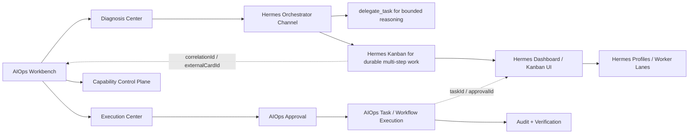

# Hermes Dashboard And Kanban Bridge Discovery - 2026-06-18

## Purpose

Validate whether upstream Hermes Dashboard and Hermes Kanban should be integrated as an external Agent-native work board instead of rebuilding the same board inside AIOps Agent.

## Sources

```text
Hermes Web Dashboard:
https://hermes-agent.nousresearch.com/docs/user-guide/features/web-dashboard

Hermes Kanban:
https://github.com/NousResearch/hermes-agent/blob/main/website/docs/user-guide/features/kanban.md

Hermes Agent repository:
https://github.com/NousResearch/hermes-agent

User-provided reference:
https://mp.weixin.qq.com/s/CYfrtxi18fxmdEpPgTFEkQ
```

## Key Findings

### Web Dashboard

```text
Command:
  hermes dashboard

Default URL:
  http://127.0.0.1:9119

Important flags:
  --port
  --host
  --no-open
  --insecure
  --isolated

Prerequisites:
  pip install 'hermes-agent[web,pty]'
```

The dashboard is a machine-level management surface. It can manage profiles, configuration, API keys, skills, MCP, models, sessions, gateway status, and browser chat.

The dashboard exposes a REST API used by its frontend. Confirmed documented endpoints include:

```text
GET /api/status
GET /api/sessions
GET /api/config
GET /api/config/defaults
```

Profile scoping is part of the URL contract:

```text
?profile=<name>
```

### Security

The dashboard can read and write sensitive Hermes state, including configuration and `.env` API keys. Default binding is localhost. Binding to `0.0.0.0` must be treated as an admin surface exposure and requires extra protection.

For AIOps integration:

```text
Do not expose raw Hermes Dashboard directly.
Prefer localhost, SSH tunnel, VPN, reverse proxy with auth, or private sidecar network.
Do not treat Hermes Dashboard auth as equivalent to AIOps role control.
Do not allow Dashboard/Kanban state transitions to bypass AIOps approvals.
```

### Kanban

Hermes Kanban is not just a visual board. It is a durable multi-agent work queue.

Confirmed model:

```text
Persistence:
  ~/.hermes/kanban.db

Task statuses:
  triage
  todo
  ready
  running
  blocked
  done
  archived

Task structure:
  title
  body
  assignee/profile
  status
  tenant
  idempotency key
  comments
  links/dependencies
  workspace
```

Kanban supports two control surfaces:

```text
Agent/tool surface:
  kanban_show
  kanban_list
  kanban_complete
  kanban_block
  kanban_heartbeat
  kanban_comment
  kanban_create
  kanban_link
  kanban_unblock

Human/automation surface:
  hermes kanban ...
  /kanban slash commands
  dashboard Kanban tab
```

Board scoping:

```text
?board=<slug>
```

Dispatcher model:

```text
Gateway-embedded dispatcher is the default.
Ready tasks are picked up by profiles/workers.
Failed spawns can auto-block after a configured failure threshold.
```

## AIOps Interpretation

### What To Reuse

```text
Hermes Dashboard:
  profile visibility
  session visibility
  skills/tools/MCP visibility
  gateway status
  browser chat when needed

Hermes Kanban:
  durable Agent work queue
  task lane visualization
  worker/profile lanes
  comments and handoffs
  task dependency links
  circuit-breaker style blocked state
```

### What AIOps Must Keep

```text
Assets:
  servers
  network devices
  Kubernetes clusters
  topology

Safety:
  credentials
  role permissions
  approvals
  production task execution
  audit logs
  verification
  rollback

Governance:
  evolution proposals
  evaluation
  staging replay
  release guard
  active release tracking
```

## Integration Architecture



## Proposed Bridge Contract

### AIOps To Hermes

```text
correlationId
sourceType
sourceId
assetReferences
alertReferences
expectedOutputSchema
allowedTools
returnUrl
```

### Hermes To AIOps

```text
correlationId
externalCardId
externalRunId
externalState
externalUrl
summary
evidence
proposedAction
requiresApproval
```

## Deployment Options

### Option A - Link Only

```text
AIOps stores Hermes Dashboard URL.
Users open Dashboard in a new tab.
No iframe.
No API sync beyond health check.
Lowest risk, fastest validation.
```

### Option B - Reverse Proxy Embed

```text
Hermes Dashboard runs on localhost or private Docker network.
AIOps or nginx reverse proxy exposes it under protected path.
AIOps controls who can see the entry.
Needs CSP, cookie/session, and websocket proxy validation.
```

### Option C - API Bridge

```text
AIOps calls Hermes Dashboard API for status, sessions, and Kanban metadata.
AIOps renders only summary and deep links.
Kanban UI remains upstream Hermes UI.
Best long-term split if APIs are stable.
```

## Recommended Next Implementation

Do not start with full embedding. Start with a read-only bridge:

```text
1. Add Hermes Dashboard settings:
   enabled
   dashboardUrl
   embedMode
   authMode
   allowedOrigins

2. Add health probe:
   GET /api/status
   reachable
   version
   active sessions
   gateway status

3. Add hermes_external_links table:
   source_type
   source_id
   correlation_id
   external_system
   external_url
   external_card_id
   external_state
   last_synced_at

4. Add UI entry:
   Capability Control Plane -> Hermes Dashboard
   Hermes Assistant -> Open linked Dashboard session
   Evolution Proposal -> Open linked Kanban card

5. Keep production execution gated:
   Kanban lane transitions may draft approval/proposal.
   They must not execute production actions directly.
```

## Open Questions

```text
Does the deployed Hermes Dashboard expose stable Kanban REST endpoints, or only frontend/internal APIs?
Can Dashboard be run as a sidecar without exposing secrets outside localhost/private network?
How should AIOps authenticate users into Dashboard: link-only, reverse proxy, or separate credentials?
Can Hermes Kanban card IDs be deterministically linked to AIOps correlation IDs or idempotency keys?
Which worker lanes map to existing AIOps Hermes channels: diagnose, remediate, evolve?
```
